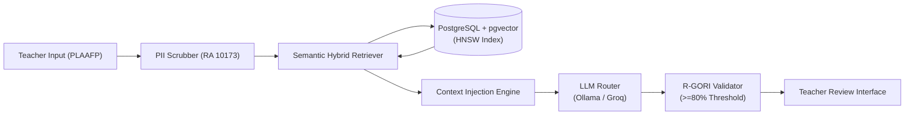

# NeuroPath RAG System: Documentation & Technical Specifications

## 1. Overview
NeuroPath's Retrieval-Augmented Generation (RAG) system upgrades **Module 2 (AI-Based IEP Generation)** and **Module 3 (Instructional Support)** from zero-shot prompt generation to an authoritative, context-grounded retrieval architecture.

The RAG engine grounds all generated Individualized Education Program (IEP) goals, lesson plans, and instructional strategies in **DepEd Region VII Special Education (SPED) guidelines**, **DepEd Order No. 021, s. 2020** (K to 12 Transition Curriculum Framework for Learners with Disabilities), and evidence-based Autism Spectrum Disorder (ASD) practices.



---

## 2. Core System Benchmarks & Non-Negotiables

| Metric / Requirement | Target Benchmark | Enforcement Mechanism |
| :--- | :--- | :--- |
| **Standard IEP Generation Latency** | $\le 10\text{ seconds}$ | HNSW approximate indexing, embedding caching, small-model routing |
| **Full Document Generation Latency** | $\le 30\text{ seconds}$ | Concurrent visual aid dispatch & batched section drafting |
| **Generation Hard Timeout** | $45\text{ seconds}$ | Client-side abort with automatic draft retention in IndexedDB |
| **Pedagogical Quality Standard** | $\ge 80\%$ compliance | Automated post-generation audit via `RGORICheckerService` |
| **Minor Data Privacy Compliance** | $100\%$ compliance, $0\%$ leak | Ephemeral regex/token surrogate PII scrubber (RA 10173) |
| **Third-Party Data Retention** | Zero Data Retention (ZDR) | Stateless API terms; no training on minor learner data |

---

## 3. Documentation Suite Index

| Document | Scope & Contents |
| :--- | :--- |
| **[Architecture & Vector Storage](architecture.md)** | End-to-end component topology, PostgreSQL `pgvector` data model, HNSW indexing, chunking strategy, and Django ORM definitions. |
| **[DepEd Frameworks & ASD Pedagogies](deped_asd_frameworks.md)** | Domain taxonomies across 6 developmental areas, DepEd DO 21 s. 2020 curriculum packages, ASD EBPs (TEACCH, PECS, PBIS), and R-GORI rubrics. |
| **[Third-Party Services & Security](third_party_services.md)** | Multi-tier LLM routing, embedding providers, caching mechanisms, and the RA 10173 PII de-identification boundary. |
| **[Pedagogical Query Pipeline](query_pipeline.md)** | PLAAFP feature extraction, metadata-filtered hybrid vector search, dynamic context injection prompts, and the automated R-GORI repair loop. |

---

## 4. Quickstart for Developers

### 4.1 Database Vector Extension
Ensure PostgreSQL has the `vector` extension enabled:
```sql
CREATE EXTENSION IF NOT EXISTS vector;
```

### 4.2 Environment Configuration
Verify your backend `.env` file contains:
```env
OPENAI_API_KEY=your_openai_api_key        # Used for text-embedding-3-small
GROQ_API_KEY=your_groq_api_key            # Used for cloud fallback LLM
OLLAMA_BASE_URL=http://localhost:11434    # Used for primary local LLM
```

### 4.3 Ingestion Management Command
Seed the curated SPED knowledge base into PostgreSQL:
```bash
python manage.py seed_rag_knowledge --file iep_management/data/seed_sped_knowledge.json
```
