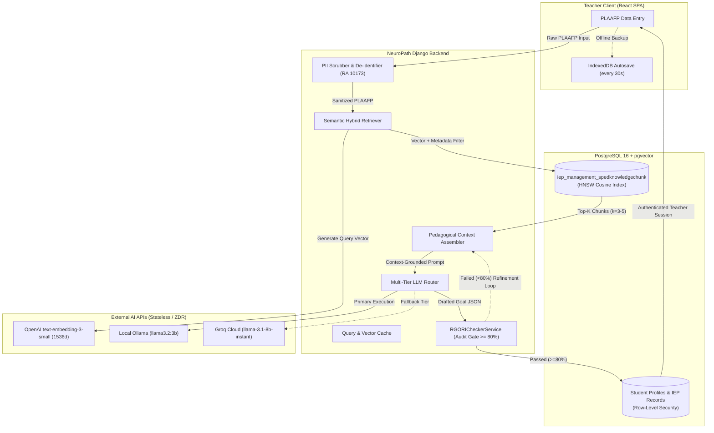

# NeuroPath RAG System: Architecture & Vector Storage Specification

## 1. Architectural Overview & Context
NeuroPath utilizes a Retrieval-Augmented Generation (RAG) pipeline to ground generated Individualized Education Program (IEP) goals, modified lesson plans, and instructional accommodations in authoritative pedagogical standards. 

This transitions Module 2 (AI-Based IEP Generation) and Module 3 (Instructional Support) from zero-shot prompt drafting to an evidence-grounded retrieval architecture aligned with **DepEd Region VII Special Education (SPED) guidelines**, **DepEd Order No. 021, s. 2020** (K to 12 Transition Curriculum Framework for Learners with Disabilities), and the **R-GORI** (Revised IFSP/IEP Goals and Objectives Rating Instrument).



---

## 2. PostgreSQL + pgvector Schema

The vector store leverages the PostgreSQL `vector` extension, co-located within the existing NeuroPath production database to eliminate secondary infrastructure overhead.

### 2.1 Database DDL
```sql
-- Enable vector extension
CREATE EXTENSION IF NOT EXISTS vector;
CREATE EXTENSION IF NOT EXISTS "uuid-ossp";

-- Table: iep_management_spedknowledgechunk
CREATE TABLE IF NOT EXISTS iep_management_spedknowledgechunk (
    id UUID PRIMARY KEY DEFAULT uuid_generate_v4(),
    content TEXT NOT NULL,
    domain VARCHAR(64) NOT NULL,
    category VARCHAR(64) NOT NULL,
    subcategory VARCHAR(64) NOT NULL,
    target_age_group VARCHAR(32) NOT NULL,
    token_count INTEGER NOT NULL,
    embedding VECTOR(1536) NOT NULL,
    metadata JSONB NOT NULL DEFAULT '{}'::jsonb,
    created_at TIMESTAMPTZ NOT NULL DEFAULT NOW(),
    updated_at TIMESTAMPTZ NOT NULL DEFAULT NOW(),

    CONSTRAINT chk_domain CHECK (domain IN (
        'Communication',
        'Socialization',
        'Sensory_Motor',
        'Adaptive_Daily_Living',
        'Behavioral',
        'Cognitive'
    )),
    CONSTRAINT chk_category CHECK (category IN (
        'DepEd_Competency',
        'ASD_Intervention',
        'RGORI_Rubric',
        'Accommodation_Strategy'
    )),
    CONSTRAINT chk_target_age CHECK (target_age_group IN (
        'Early_Childhood',
        'Elementary_Primary',
        'Elementary_Intermediate',
        'All_Elementary'
    ))
);

-- Fast Approximate Nearest Neighbor (ANN) Search Index
CREATE INDEX IF NOT EXISTS idx_spedknowledgechunk_embedding_hnsw
ON iep_management_spedknowledgechunk
USING hnsw (embedding vector_cosine_ops)
WITH (m = 16, ef_construction = 64);

-- Composite B-tree Index for Metadata Filtering
CREATE INDEX IF NOT EXISTS idx_spedknowledgechunk_filter
ON iep_management_spedknowledgechunk (domain, category, subcategory);
```

### 2.2 Django ORM Model Definition
```python
import uuid
from django.db import models
from pgvector.django import VectorField, HnswIndex

class SpedKnowledgeChunk(models.Model):
    class DomainChoices(models.TextChoices):
        COMMUNICATION = 'Communication', 'Communication & Language'
        SOCIALIZATION = 'Socialization', 'Socialization & Interpersonal'
        SENSORY_MOTOR = 'Sensory_Motor', 'Sensory & Motor Integration'
        ADAPTIVE = 'Adaptive_Daily_Living', 'Adaptive & Daily Living Skills'
        BEHAVIORAL = 'Behavioral', 'Behavioral & Emotional Self-Regulation'
        COGNITIVE = 'Cognitive', 'Cognitive & Functional Academics'

    class CategoryChoices(models.TextChoices):
        DEPED_COMPETENCY = 'DepEd_Competency', 'DepEd Competency'
        ASD_INTERVENTION = 'ASD_Intervention', 'ASD Intervention'
        RGORI_RUBRIC = 'RGORI_Rubric', 'R-GORI Rubric'
        ACCOMMODATION = 'Accommodation_Strategy', 'Accommodation Strategy'

    class TargetAgeChoices(models.TextChoices):
        EARLY_CHILDHOOD = 'Early_Childhood', 'Early Childhood (Kindergarten)'
        ELEM_PRIMARY = 'Elementary_Primary', 'Elementary Primary (Grades 1-3)'
        ELEM_INTERMEDIATE = 'Elementary_Intermediate', 'Elementary Intermediate (Grades 4-6)'
        ALL_ELEM = 'All_Elementary', 'All Elementary'

    id = models.UUIDField(primary_key=True, default=uuid.uuid4, editable=False)
    content = models.TextField(help_text="Curated text unit containing pedagogical guidance.")
    domain = models.CharField(max_length=64, choices=DomainChoices.choices)
    category = models.CharField(max_length=64, choices=CategoryChoices.choices)
    subcategory = models.CharField(max_length=64, help_text="Specific framework, e.g., PECS, TEACCH, SensoryDiet, PBIS")
    target_age_group = models.CharField(max_length=32, choices=TargetAgeChoices.choices, default=TargetAgeChoices.ALL_ELEM)
    token_count = models.PositiveIntegerField()
    embedding = VectorField(dimensions=1536, help_text="OpenAI text-embedding-3-small vector representation")
    metadata = models.JSONField(default=dict, blank=True)
    created_at = models.DateTimeField(auto_now_add=True)
    updated_at = models.DateTimeField(auto_now=True)

    class Meta:
        db_table = 'iep_management_spedknowledgechunk'
        indexes = [
            HnswIndex(
                name='idx_sped_chunk_hnsw',
                fields=['embedding'],
                m=16,
                ef_construction=64,
                opclasses=['vector_cosine_ops']
            ),
            models.Index(fields=['domain', 'category', 'subcategory'], name='idx_sped_chunk_meta'),
        ]

    def __str__(self):
        return f"[{self.domain} | {self.subcategory}] {self.content[:60]}..."
```

---

## 3. HNSW Index Parameter Optimization
The Hierarchical Navigable Small World (HNSW) indexing algorithm was chosen over Inverted File Flat (IVFFlat) for three primary reasons:
1. **Zero Training Phase**: HNSW does not require a cluster centroid warm-up phase, allowing real-time inserts and updates as new DepEd competencies are ingested.
2. **Predictable Query Latency**: Under cosine distance search, query execution time scales logarithmically ($O(\log N)$), ensuring vector search completes in $\le 8\text{ ms}$ over thousands of curated chunks.
3. **High Recall at Low Search Depths**:
   - `m = 16`: Number of bidirectional links established per node. Provides an optimal balance between index build memory and recall.
   - `ef_construction = 64`: Size of the dynamic candidate list evaluated during index construction, guaranteeing $>98\%$ nearest neighbor recall.
   - Runtime `hnsw.ef_search = 40`: Configured per database connection session during retrieval for sub-10ms lookup latency.

---

## 4. Chunking Strategy & Ingestion Protocol
Unlike generic text chunking (which relies on arbitrary character counts or fixed sliding windows), NeuroPath employs **Domain-Atomic Semantic Chunking**:
- **Atomic Unit Scope**: Every chunk encapsulates exactly one coherent pedagogical instruction, diagnostic rubric element, or curricular competency. Chunks never truncate mid-sentence, mid-indicator, or across rubric dimensions.
- **Chunk Size Constraints**: 150 to 350 tokens (using the `cl100k_base` tokenizer). This range provides sufficient semantic context for embedding models while avoiding dilution of specialized terminology.
- **Header Injection**: Every chunk incorporates a structured metadata prefix during embedding:
  ```
  [DOMAIN: Communication] [CATEGORY: ASD_Intervention] [SUBCATEGORY: PECS_Phase_3] [TARGET: Elementary_Primary]
  Picture Exchange Communication System (PECS) Phase III: Discrimination Between Pictures.
  The learner requests desired items by navigating a communication book, selecting the matching picture card from a choice array of 4 distinct icons, and presenting the token to the communicative partner with 80% independent accuracy across 5 consecutive trials.
  ```

---

## 5. Latency Budget Allocation (Target $\le 10\text{s}$)

To satisfy the strict Software Requirements Specification (SRS) requirement of $\le 10\text{ seconds}$ standard IEP generation turnaround:

| Pipeline Stage | Subsystem | Target Latency | Optimization Mechanism |
| :--- | :--- | :--- | :--- |
| 1. PII Scrubbing & Validation | Django Middleware | $\le 20\text{ ms}$ | Compiled in-memory regex + token surrogate mapping |
| 2. Query Embedding | OpenAI API | $180 - 350\text{ ms}$ | `text-embedding-3-small` lightweight API call; MD5 cached |
| 3. Vector Hybrid Retrieval | PostgreSQL HNSW | $\le 15\text{ ms}$ | Partitioned index with metadata B-tree pre-filtering |
| 4. Prompt Synthesis | Django Service Layer | $\le 10\text{ ms}$ | Pre-compiled string templates in memory |
| 5. LLM Inference | Ollama / Groq | $3,500 - 6,500\text{ ms}$ | Streaming token evaluation with low max_tokens (450) |
| 6. R-GORI Quality Audit | RGORICheckerService | $800 - 1,400\text{ ms}$ | Structured JSON parsing & deterministic rule evaluator |
| **Total Turnaround** | **End-to-End** | **$4.5\text{s} - 8.3\text{s}$** | **Safely within the $\le 10\text{s}$ SLA ceiling** |
