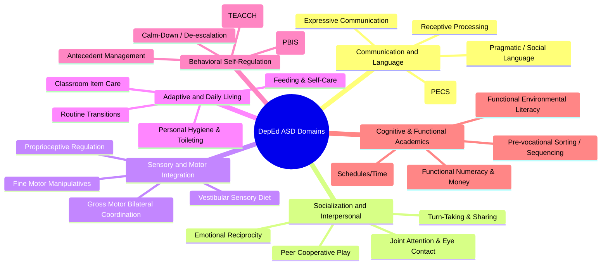

# NeuroPath RAG System: DepEd Curricular Standards & ASD Pedagogical Frameworks

## 1. Regulatory Context & Policy Mandates
NeuroPath's knowledge retrieval layer is strictly aligned with the policy directives of the **Department of Education (DepEd) Philippines**, specifically designed to address public school special education programs in **Region VII (Central Visayas)**:

- **DepEd Order No. 021, s. 2020**: *Policy Guidelines on the Adoption of the K to 12 Transition Curriculum Framework for Learners with Disabilities (LWDs)*. Mandates personalized life skill preparation, daily living competencies, and functional academic pathways for elementary learners.
- **DepEd MATATAG Curriculum**: Focuses foundational key-stage learning on essential literacy and numeracy, requiring specialized adaptations and assistive scaffolding for non-verbal or neurodivergent learners.
- **DepEd Special Education Manual (2007/2020 Update)**: Establishes individualized educational planning standards and functional assessment baselines (PLAAFP).

---

## 2. Six Core Developmental Domains (Vector Taxonomy)

All knowledge base chunks, vector metadata filters, and IEP goal generation pipelines are partitioned into six mutually exclusive developmental domains:



### 2.1 Communication & Language
- **Focus**: Enabling functional communication to reduce frustration-induced behaviors.
- **Competency Progression**:
  - *Non-verbal / Pre-intentional*: Responding to communicative bids, establishing joint attention, requesting preferred items using physical gestures.
  - *Symbolic / AAC*: Using single-picture exchanges (PECS Phase I–II), discriminating symbols on a communication board (PECS Phase III), constructing multi-symbol carrier phrases ("I want ___") (PECS Phase IV).
  - *Expressive & Social Communication*: Answering simple social questions, identifying basic needs, labeling items in the natural environment.

### 2.2 Socialization & Interpersonal Interaction
- **Focus**: Building interactive social reciprocity and cooperative play with peers and adults.
- **Competency Progression**:
  - *Parallel Play*: Engaging alongside peers in shared physical spaces without disruptive behaviors.
  - *Turn-Taking*: Participating in structured 2-to-3 turn board or ball games with verbal/visual prompting.
  - *Social Greetings*: Responding to teacher/peer greetings upon arrival and departure using vocalization, sign, or communication cards.

### 2.3 Sensory Processing & Motor Integration
- **Focus**: Managing sensory hyper-/hypo-reactivity to sustain attention during classroom instruction.
- **Competency Progression**:
  - *Sensory Diet Accommodations*: Utilizing sensory tools (weighted lap pads, noise-canceling headphones, tactile fidgets) upon feeling overstimulated.
  - *Fine Motor Dexterity*: Developing modified functional pincer grasp, utilizing adapted scissors, opening pencil cases and food containers.
  - *Gross Motor & Coordination*: Navigating classroom obstacles, walking in line during group transitions, maintaining seated posture at workstations.

### 2.4 Adaptive & Daily Living Skills (Life Skills)
- **Focus**: Promoting autonomy in essential personal care and school daily routines (DepEd Transition Package 1).
- **Competency Progression**:
  - *Toileting Independence*: Recognizing physiological need, requesting restroom access, managing clothing and handwashing routines.
  - *Feeding & Mealtime*: Unpacking lunch containers, utilizing utensils appropriately, cleaning up eating space.
  - *School Readiness*: Unpacking backpacks, locating personal cubbies, returning classroom materials to assigned stations.

### 2.5 Behavioral & Emotional Self-Regulation
- **Focus**: Replacing maladaptive behaviors (elopement, aggression, meltdowns) with functional adaptive responses.
- **Competency Progression**:
  - *Emotional Identification*: Recognizing basic emotional states using visual feelings charts (e.g., Zones of Regulation).
  - *Coping Mechanism Execution*: Requesting a sensory break or quiet-corner transition before behavioral escalation occurs.
  - *PBIS Alignment*: Earning positive reinforcement tokens for remaining in designated learning zones during teacher-directed tasks.

### 2.6 Cognitive & Functional Academics
- **Focus**: Practical, high-utility academic skills that support everyday independence.
- **Competency Progression**:
  - *Functional Literacy*: Recognizing environmental survival signs (STOP, DANGER, EXIT, RESTROOM), identifying personal printed name.
  - *Functional Numeracy*: Matching quantities 1–10 to concrete objects, recognizing Philippine currency denominations (₱1, ₱5, ₱10, ₱20) for school canteen transactions.
  - *Task Sequencing*: Completing multi-step vocational assembly tasks using visual recipe cards.

---

## 3. Evidence-Based Practices (EBPs) for ASD

All retrieved knowledge chunks must represent established, clinically verified interventions:

| EBP Framework | Pedagogical Mechanics | RAG Knowledge Retrieval Application |
| :--- | :--- | :--- |
| **TEACCH Structured Teaching** | Physical workspace structuring, visual daily schedules, left-to-right work-baskets, clear visual finish lines. | Injected into **Module 3 Lesson Plans** to specify physical layout and structured task systems. |
| **PECS (Picture Exchange Communication System)** | 6-Phase systematic exchange: Phase I (Physical Exchange), Phase II (Distance/Persistence), Phase III (Picture Discrimination), Phase IV (Sentence Structure), Phase V (Responsive Requesting), Phase VI (Commenting). | Injected into **Module 2 IEP Goals** for non-verbal learners requiring concrete AAC targets. |
| **PBIS (Positive Behavior Interventions & Supports)** | Antecedent modification, token economies, functional behavior replacement, non-punitive extinction. | Injected into behavioral IEP goals to ensure positive, observable replacement skills. |
| **Sensory Diets & Integration** | Scheduled vestibular, proprioceptive, and deep-pressure breaks integrated into the school day. | Formulates instructional accommodations within IEP Section 4. |

---

## 4. The R-GORI 4-Pillar Evaluation Matrix

The **Revised IFSP/IEP Goals and Objectives Rating Instrument (R-GORI)** (adapted from Notari-Syverson & Shuster, 1995) provides the automated evaluation rubric implemented by `RGORICheckerService`. A generated IEP goal must score **$\ge 80 / 100$** to pass the automated audit gate.

```
Total R-GORI Score = Measurability (25) + Functionality (25) + Generality (25) + Instructional Context (25)
Passing Threshold: Score >= 80%
```

### Criterion 1: Measurability (25 Points)
- **Observable Behavior (12 pts)**:
  - *Full Points*: The goal utilizes an observable action verb with a distinct beginning and end that two independent observers would agree occurred.
  - *Approved Verbs*: `identifies`, `points to`, `selects`, `requests`, `names`, `sorts`, `copies`, `initiates`, `manipulates`, `follows`, `hands over`, `assembles`.
  - *Prohibited Verbs (0 pts)*: `understands`, `learns`, `knows`, `appreciates`, `experiences`, `tries to`, `feels`.
- **Performance Criterion (13 pts)**:
  - Must state *how* success is quantified across Accuracy (e.g., *with 80% accuracy*), Frequency (*4 out of 5 trials*), Latency (*within 10 seconds of directive*), or Duration (*for 5 consecutive minutes across 3 school days*).

### Criterion 2: Functionality (25 Points)
- **Participation (12 pts)**: The skill is necessary for the learner to access, respond to, or participate in everyday activities across school, home, or community.
- **Task Completion (13 pts)**: If the child cannot perform the behavior, someone else would have to do it for them (e.g., dressing, requesting a restroom break, packing up belongings).

### Criterion 3: Generality (25 Points)
- **General Behavioral Concept (12 pts)**: The goal addresses a broad behavioral skill (e.g., *communicates choices using visual symbols*) rather than a single drill locked to one specific toy or flashcard.
- **Across Settings & People (13 pts)**: The goal explicitly states or implies execution across at least two distinct settings (e.g., *classroom and canteen*) or with multiple communicative partners (e.g., *teachers, parents, and peers*).

### Criterion 4: Instructional Context (25 Points)
- **Natural Routine Integration (12 pts)**: The skill can be taught and practiced during regular daily routines rather than requiring artificial clinical setups.
- **Jargon-Free Team Feasibility (13 pts)**: Written in clear, accessible educational language so that general education teachers, SPED paraprofessionals, and parents can easily support and track progress.

---

## 5. Curated Vector Chunk Metadata Example

```json
{
  "id": "c8b4172e-3351-4d1a-9f5e-7a52140d0a21",
  "domain": "Communication",
  "category": "ASD_Intervention",
  "subcategory": "PECS_Phase_4",
  "target_age_group": "Elementary_Primary",
  "content": "Picture Exchange Communication System (PECS) Phase IV: Sentence Structure. The student requests desired items using a multi-word phrase by constructing a sentence strip featuring an 'I want' icon followed by an item picture icon, detaching the strip, and handing it to the communicative partner with 80% independent accuracy across 4 consecutive classroom sessions.",
  "metadata": {
    "framework": "PECS",
    "evidence_tier": "EBP_High",
    "deped_alignment": {
      "policy_order": "DO_021_s2020",
      "package": "Package_1_Care_and_Daily_Living",
      "competency_code": "SPED-ASD-COMM-P4"
    },
    "rgori_mapping": {
      "observable_verb": "detaching and handing",
      "measurable_criterion": "80% independent accuracy across 4 consecutive classroom sessions",
      "functionality_indicator": "Independent expression of wants and needs",
      "generality_indicator": "Multi-item vocabulary across classroom sessions",
      "context_indicator": "Natural classroom communication routines"
    }
  }
}
```
