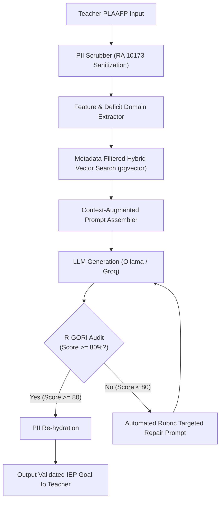
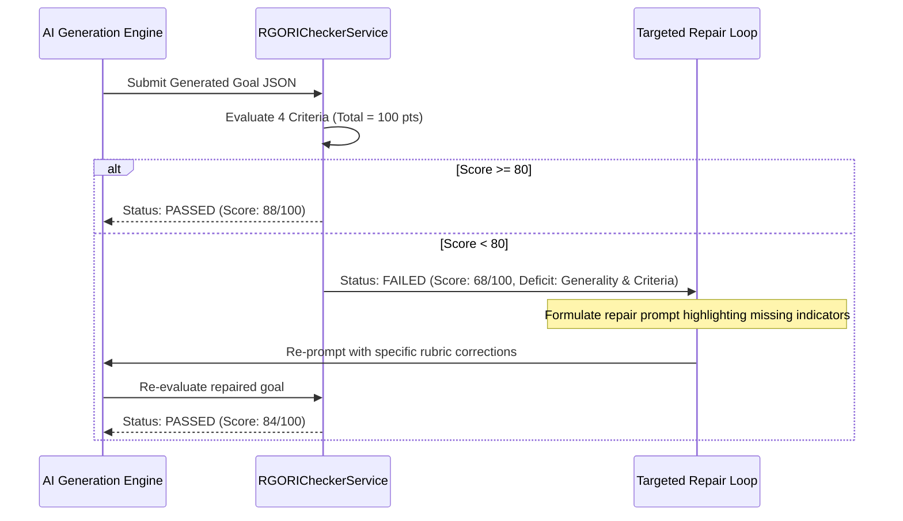

# NeuroPath RAG System: Pedagogical Query Pipeline & R-GORI Validation

## 1. Pipeline Overview & Data Flow
The pedagogical query pipeline translates unstandardized teacher input (Present Levels of Academic Achievement and Functional Performance - PLAAFP) into verified, SMART, and R-GORI-compliant IEP goals and instructional strategies.



---

## 2. Step 1: PLAAFP Feature & Domain Extraction

When a teacher completes the student profiling form or submits a PLAAFP baseline:
1. **Target Developmental Domain**: The primary deficit domain (e.g., `Communication`, `Socialization`, `Behavioral`) is extracted from the form selection.
2. **Current Baseline Extraction**: Specific behavioral deficits, current level of functioning (e.g., "non-verbal", "gestural prompting only", "frustration tantrums"), and preferred reinforcers are identified.
3. **Query Construction**:
   ```python
   def construct_retrieval_query(student_profile: dict) -> str:
       domain = student_profile.get('target_domain', 'Communication')
       plaafp = student_profile.get('baseline_summary', '')
       preferences = student_profile.get('preferences', '')
       return f"Domain: {domain}. Baseline: {plaafp}. Reinforcers/Preferences: {preferences}"
   ```

---

## 3. Step 2: Metadata-Filtered Hybrid Vector Retrieval

Retrieval combines exact metadata partition filtering with cosine similarity search over `pgvector`:

### 3.1 SQL Retrieval Query
```sql
SELECT 
    id,
    content,
    domain,
    category,
    subcategory,
    1 - (embedding <=> %(query_embedding)s) AS cosine_similarity
FROM iep_management_spedknowledgechunk
WHERE domain = %(target_domain)s
  AND (category IN ('DepEd_Competency', 'ASD_Intervention', 'RGORI_Rubric'))
  AND (target_age_group = %(target_age_group)s OR target_age_group = 'All_Elementary')
ORDER BY embedding <=> %(query_embedding)s
LIMIT %(top_k)s;
```

### 3.2 Threshold & Filtering Parameters
- **Top-K Chunks**: $k = 3 \text{ to } 5$ chunks.
- **Cosine Distance Cutoff**: $distance \le 0.35$ (Similarity $\ge 0.65$).
- **Diversity Injection**: If $k=4$, the retriever ensures at least 1 chunk is a DepEd competency, 2 chunks are evidence-based ASD interventions (e.g., PECS or TEACCH), and 1 chunk is an R-GORI criteria exemplar.

---

## 4. Step 3: Context-Augmented Prompt Template

Retrieved chunks are injected directly into the LLM system prompt as immutable pedagogical constraints:

```text
You are an expert Special Education (SPED) Curriculum Specialist for DepEd Region VII.
Your role is to draft a single Individualized Education Program (IEP) Annual Goal based on the provided learner profile and authoritative reference knowledge.

PEDAGOGICAL KNOWLEDGE BASE (GROUNDING CONTEXT):
----------------------------------------
{retrieved_chunks_text}
----------------------------------------

STUDENT CONTEXT (DE-IDENTIFIED):
- Student Identifier: {surrogate_student_id}
- Target Developmental Domain: {domain}
- Current Baseline Level: {sanitized_baseline}
- Age Group: {age_bracket}

STRICT CONSTRAINTS (R-GORI & SMART COMPLIANCE):
1. Use an APPROVED observable action verb (e.g., answers, classifies, communicates, copies, defines, follows, greets, identifies, imitates, initiates, labels, locates, manipulates, matches, names, points, prints, produces, reads, reaches, remains, requests, responds, selects, signs, sorts, uses, vocalizes, verbalizes, writes).
2. NEVER use vague internal verbs (understands, knows, appreciates, explores, learns).
3. Include explicit quantifiable criteria: Accuracy (%), Frequency (X out of Y trials), or Duration.
4. Ensure the behavior is functional for daily life participation and teachable across natural school routines.
5. Formulate the goal across different people, materials, or settings.

Output valid JSON only with keys:
{
  "annual_goal": "...",
  "target_domain": "...",
  "observable_verb": "...",
  "measurable_criterion": "...",
  "aligned_ebp": "...",
  "deped_competency_code": "..."
}
```

---

## 5. Step 4: Automated R-GORI Audit & Targeted Repair Loop

Before displaying the drafted goal to the teacher, the response passes through the `RGORICheckerService`:



### 5.1 Rubric Repair Prompt Mechanism
If the audit score falls below 80, the system triggers one automated correction cycle without human intervention:
```text
The generated goal scored {score}/100 and failed the following R-GORI criteria:
{diagnostic_feedback}

Deficit Indicators:
- Measurability: {measurability_feedback}
- Generality: {generality_feedback}

Revise the goal to immediately resolve these specific deficits while preserving the original learning target. Output the revised goal in JSON.
```
