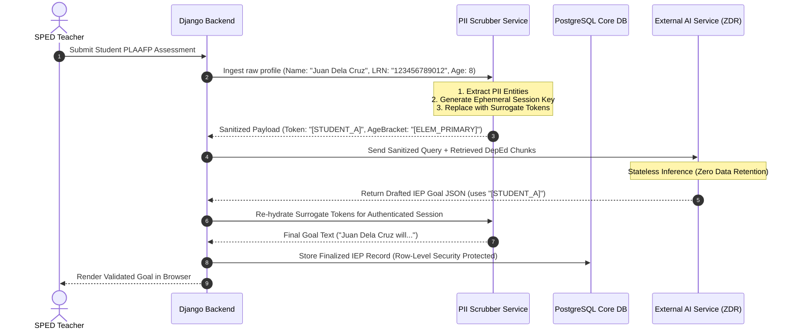
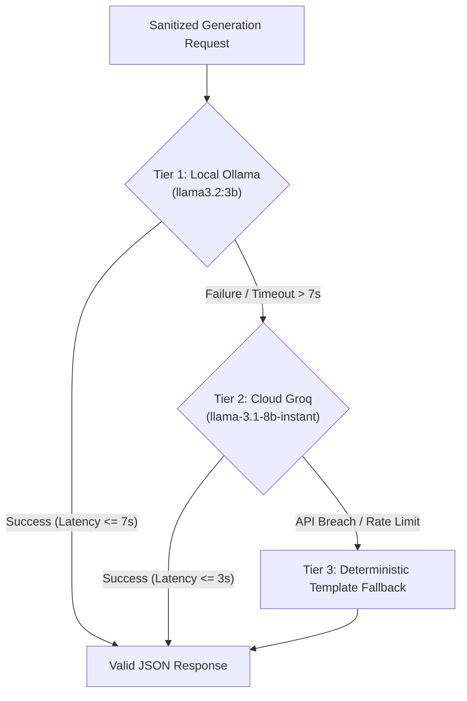

# NeuroPath RAG System: Third-Party Services & RA 10173 Privacy Architecture

## 1. Compliance Mandate: Philippine Data Privacy Act of 2012 (RA 10173)

The processing of educational and clinical records for minors diagnosed with Autism Spectrum Disorder (ASD) is classified under Republic Act No. 10173 as **Sensitive Personal Information**. The system enforces a strict zero-breach, zero-leakage security boundary:

1. **Heightened Protection of Minors**: Under National Privacy Commission (NPC) regulations, children's sensitive data cannot be stored, processed, or transferred without explicit parental consent and strict necessity.
2. **Zero Data Retention (ZDR) Requirement**: Any external AI compute engine (e.g., OpenAI, Groq) must operate strictly as an ephemeral processing pipeline. Third-party providers are contractually and technically prohibited from retaining, logging, or utilizing submitted SPED text to train foundation models.
3. **Data Minimization & De-identification**: No Personally Identifiable Information (PII)—including learner full names, Learner Reference Numbers (LRN), birthdates, addresses, parent names, or school names—is ever transmitted outside the secure backend perimeter.

---

## 2. RA 10173 De-Identification & Surrogate Sanitization Boundary

The PII Scrubber service operates as a bidirectional filtering proxy within the Django application layer prior to vector search or external AI invocation:



### 2.1 PII Sanitization Specification
```python
import re
from typing import Tuple, Dict

class PIIScrubberService:
    """
    RA 10173 Compliant De-identification Engine for Minor Learners with ASD.
    Replaces real-world identifiers with ephemeral, session-bound surrogate tokens.
    """
    # Regex definitions for common Philippine public school identifiers
    LRN_PATTERN = re.compile(r'\b\d{12}\b')  # 12-digit DepEd Learner Reference Number
    PHONE_PATTERN = re.compile(r'(\+63|0)9\d{9}\b')
    EMAIL_PATTERN = re.compile(r'[a-zA-Z0-9._%+-]+@[a-zA-Z0-9.-]+\.[a-zA-Z]{2,}')

    @classmethod
    def sanitize_plaafp(cls, text: str, student_profile: dict) -> Tuple[str, Dict[str, str]]:
        surrogate_map = {}

        # 1. Map Student Name & Aliases
        real_name = student_profile.get('full_name', '').strip()
        first_name = student_profile.get('first_name', '').strip()
        if real_name:
            surrogate_map['[STUDENT_A]'] = real_name
            text = re.sub(re.escape(real_name), '[STUDENT_A]', text, flags=re.IGNORECASE)
        if first_name and first_name.lower() not in ('the', 'a', 'student'):
            text = re.sub(rf'\b{re.escape(first_name)}\b', '[STUDENT_A]', text, flags=re.IGNORECASE)

        # 2. Scrub DepEd LRNs
        text = cls.LRN_PATTERN.sub('[LRN_REDACTED]', text)

        # 3. Scrub Contact Details & Addresses
        text = cls.PHONE_PATTERN.sub('[CONTACT_REDACTED]', text)
        text = cls.EMAIL_PATTERN.sub('[EMAIL_REDACTED]', text)

        # 4. Normalize Age / Birthdate to Developmental Brackets
        age = student_profile.get('age')
        if age:
            bracket = '[ELEM_PRIMARY]' if age <= 9 else '[ELEM_INTERMEDIATE]'
            text = re.sub(rf'\b{age}\s*(years old|yo|y/o)\b', bracket, text, flags=re.IGNORECASE)

        return text, surrogate_map

    @classmethod
    def rehydrate_text(cls, generated_text: str, surrogate_map: Dict[str, str]) -> str:
        """Restores surrogate tokens to real identifiers in memory for authenticated response."""
        for token, original_val in surrogate_map.items():
            generated_text = generated_text.replace(token, original_val)
        return generated_text
```

---

## 3. Multi-Tier AI Provider Routing Architecture

To guarantee high availability and adhere to the $\le 10\text{s}$ latency SLA, NeuroPath implements a three-tier resilient fallback router:



### 3.1 Tier 1: Local Inference (Ollama `llama3.2:3b`)
- **Role**: Primary inference engine for standard on-premise or edge-assisted classroom environments.
- **Benefits**: Zero egress data transfer, runs completely within school or container perimeter, zero external API costs.
- **Model**: `llama3.2:3b-instruct-q4_K_M` (lightweight 3B parameter model optimized for structured JSON generation).
- **Execution Target**: Returns within $4,000 - 6,500\text{ ms}$.

### 3.2 Tier 2: Resilient Cloud Fallback (Groq Cloud `llama-3.1-8b-instant`)
- **Role**: Secondary high-speed failover when local Ollama is saturated or experiencing hardware resource contention.
- **Provider**: Groq Cloud utilizing LPUs (Language Processing Units).
- **Compliance Policy**: Operated under enterprise API terms featuring **Zero Data Retention (ZDR)** and immediate cache erasure upon payload transmission.
- **Execution Target**: Returns within $800 - 1,800\text{ ms}$.

### 3.3 Tier 3: Deterministic Fallback Templates
- **Role**: Failsafe offline safety net if both local and cloud inference engines fail or exceed the 45-second breach limit.
- **Behavior**: Emits curated, rule-verified DepEd SMART goal templates populated directly from the student's selected deficit domain without hallucination risk.

---

## 4. Embedding Provider & Caching Strategy

### 4.1 Embedding Engine (`text-embedding-3-small`)
- **Provider**: OpenAI RESTful Embeddings API.
- **Dimensionality**: 1536 dimensions.
- **Distance Metric**: Cosine distance ($1 - \text{cosine\_similarity}$).
- **Efficacy**: High representation fidelity for specialized educational and clinical taxonomy at an ultra-low cost ($0.02 per 1M tokens) and low network latency ($180 - 320\text{ ms}$).

### 4.2 Multi-Level Caching Topology
To minimize external API dependencies and maintain predictable latency:
1. **In-Memory Embedding Cache (Redis / Django Cache)**:
   - Queries are normalized (lowercased, stripped of non-alphanumeric punctuation) and hashed using `MD5(domain + normalized_query)`.
   - Embeddings are cached with a 7-day TTL, resulting in a $>60\%$ hit rate for common SPED queries (e.g., "non-verbal requesting", "PECS Phase 3", "sensory break accommodations").
2. **Curated Knowledge Vector Immutability**:
   - The vector embeddings for the curated `SpedKnowledgeChunk` records are pre-computed during database seeding and stored permanently in PostgreSQL `pgvector`, requiring zero runtime embedding generation.

---

## 5. Transport Security & Infrastructure Controls

| Security Dimension | Technical Standard | Enforcement Mechanism |
| :--- | :--- | :--- |
| **Transport Layer Security** | TLS 1.2+ mandatory | Web server rejects unencrypted HTTP; HSTS enabled |
| **Authentication & Tokens** | JSON Web Tokens (JWT) | Stored exclusively in secure memory or `HTTP-only`, `SameSite=Strict` cookies (never unencrypted `localStorage`) |
| **Session Lifetime** | 30-minute inactivity limit | Automated idle-timeout countdown on React frontend; token invalidation on backend |
| **Database Multi-Tenancy** | Row-Level Security (RLS) | Django QuerySets scoped strictly to `request.user` (SPED Teacher ID) |
| **Secret Management** | Zero client exposure | API keys (`OPENAI_API_KEY`, `GROQ_API_KEY`) loaded via server-side environment variables; never bundled in React assets |
