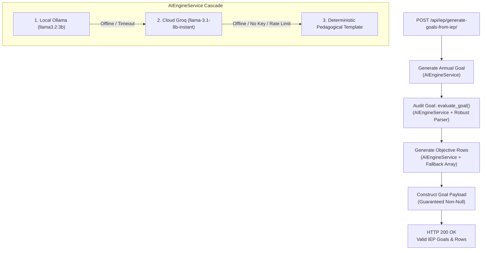

# Implementation Plan - Issue #129: Rewire R-GORI Validation and Objective Generation to Resilient AIEngineService Cascade

**Date**: 2026-09-11  
**Author**: Senior Software Engineer / Antigravity AI  
**Issue**: [#129 [BE] [FIX]: rewire R-GORI validation and objective generation to resilient AIEngineService cascade](https://github.com/jones21312321313213/NeuroPath/issues/129)  
**Scope**: `neuropath-backend/iep_management`

---

## 1. Problem Summary & Root Cause Analysis

When users trigger "Generate Final IEP" (`POST /api/iep/generate-goals-from-iep/`), the request frequently fails with `500 Internal Server Error`: `"Failed to generate AI goals: Goal generation failed."`

### Root Causes:
1. **Direct `CustomLlamaService` Bypasses**:
   - `RGORICheckerService.evaluate_goal()` directly invoked `CustomLlamaService.generate_text(eval_prompt)` in [rgori_service.py](file:///C:/Users/John%20Lyster/orca/workspaces/NeuroPath/be-fix-rewire-r-gori-validation-and-objective-ge/neuropath-backend/iep_management/rgori_service.py#L125).
   - `GenerateIEPGoalsFromIEPView._generate_objective_rows()` directly invoked `CustomLlamaService.generate_text(prompt)` in [views.py](file:///C:/Users/John%20Lyster/orca/workspaces/NeuroPath/be-fix-rewire-r-gori-validation-and-objective-ge/neuropath-backend/iep_management/views.py#L713).
   - `GenerateIEPGoalAPIView.post()` directly invoked `CustomLlamaService.generate_text(generation_prompt)` in [views.py](file:///C:/Users/John%20Lyster/orca/workspaces/NeuroPath/be-fix-rewire-r-gori-validation-and-objective-ge/neuropath-backend/iep_management/views.py#L407).
2. **Unhandled Exceptions on Network/Key/Rate-Limit Outages**:
   - `CustomLlamaService` raises raw Python `Exception` on timeout, missing key (`MISSING_KEY`), 401, 429 rate limit, or connection errors. When Groq is unreachable or unconfigured, this unhandled exception aborts all retry attempts.
3. **Fragile JSON Parsing & Zero-Score Initialization Trap**:
   - If AI returns markdown backticks, non-JSON text, or deterministic fallback text, `json.loads` fails.
   - In `RGORICheckerService.evaluate_goal()`, JSON decode errors returned `total_score: 0`.
   - In `GenerateIEPGoalsFromIEPView._generate_validated_goal()`, `best_score` was initialized to `0`. With `if score > best_score:` checking `0 > 0` (which is `False`), `best_payload` stayed `None`. After 3 attempts, `_generate_validated_goal` returned `(None, "Generation failed after max attempts.")`, yielding an unhandled `500 Internal Server Error`.

---

## 2. Proposed Architecture & Solution Strategy

We will route all goal generation, R-GORI evaluation, and objective row synthesis through the resilient cascade in `AIEngineService` (Ollama → Groq → Deterministic Fallback):



### Key Technical Improvements:
1. **Rewire `RGORICheckerService` to `AIEngineService`**:
   - Separate system prompt and evaluation rubric into clean `system_prompt` and `prompt`.
   - Invoke `AIEngineService.generate_text(prompt, system_prompt=system_prompt, max_tokens=300, json_mode=True)`.
2. **Robust JSON Parsing & Pedagogical Fallback Scoring**:
   - Strip markdown code blocks (` ```json ... ``` `), backticks, and extraneous whitespace.
   - Validate extracted fields: `total_score`, `breakdown` (all 4 criteria), `compliant`, and `feedback`.
   - If response is unparsable or from deterministic fallback, apply a compliant baseline score (e.g. `total_score: 75`, `compliant: True`, valid breakdown) so offline workflows proceed smoothly.
3. **Rewire `_generate_objective_rows` to `AIEngineService`**:
   - Invoke `AIEngineService.generate_text(prompt, system_prompt=system_prompt, max_tokens=600, json_mode=True)`.
   - Safely parse JSON array or single object, ensuring a valid list of objective row dictionaries.
   - Return structured deterministic fallback row if AI returns non-JSON or offline template.
4. **Resilient Loop in `_generate_validated_goal` and `GenerateIEPGoalAPIView`**:
   - Guarantee `best_payload` is assigned on attempt 1 (`if best_payload is None or score > best_score`).
   - Ensure the view always returns HTTP 200 with valid goals and objective rows regardless of provider connectivity.

---

## 3. Step-by-Step Implementation Plan

### Task 1: Rewire `RGORICheckerService` to `AIEngineService` with Robust JSON Parsing & Fallback Scoring

**Files to Modify:**
- `neuropath-backend/iep_management/rgori_service.py`

**Steps:**
1. Replace `from .huggingface_service import CustomLlamaService` with `from .ai_engine import AIEngineService`.
2. In `RGORICheckerService.evaluate_goal(goal_text, student_context)`:
   - Structure `system_prompt` and `user_prompt` cleanly.
   - Call `raw_evaluation, _ = AIEngineService.generate_text(prompt=eval_prompt, system_prompt=system_prompt, max_tokens=300, json_mode=True)`.
   - Implement `_parse_rgori_response(raw_evaluation)` helper:
     - Strip markdown code fences (`re.sub(r'^```(?:json)?\s*|\s*```$', '', raw.strip(), flags=re.IGNORECASE | re.DOTALL)` or regex match `{...}`).
     - Parse JSON.
     - Validate `total_score`, `breakdown` (`measurability`, `functionality`, `generality`, `instructional_context`), `compliant`, and `feedback`.
     - Fallback to compliant deterministic score (`total_score: 75`, `compliant: True`) if JSON is empty, unparsable, or missing R-GORI criteria.

---

### Task 2: Rewire `_generate_objective_rows` and Validation Loops in `iep_management/views.py`

**Files to Modify:**
- `neuropath-backend/iep_management/views.py`

**Steps:**
1. In `GenerateIEPGoalsFromIEPView._generate_objective_rows()`:
   - Split prompt into `system_prompt` and `user_prompt`.
   - Replace `CustomLlamaService.generate_text(...)` with `raw, _ = AIEngineService.generate_text(user_prompt, system_prompt=system_prompt, max_tokens=600, json_mode=True)`.
   - Clean markdown code fences and parse JSON.
   - If parsing fails or rows are empty, return formatted fallback objective row:
     ```python
     return [{
         "enroute_objectives": f"Student will demonstrate an initial sub-skill toward: {annual_goal[:120]}",
         "interventions_procedures": f"Use {assistive_tech or 'visual supports'} and structured practice to support {goal_area or 'the goal area'}.",
         "timeline_mins_session": "15-20 minutes every day",
         "individuals_responsible": facilitators or "SNED Teacher",
         "progress_instructional": "Monitor weekly progress through teacher observation and skill checklists.",
         "remarks": "To be updated based on actual learning outcomes."
     }]
     ```
2. In `GenerateIEPGoalsFromIEPView._generate_validated_goal()`:
   - Ensure `if best_payload is None or score > best_score:` correctly assigns `best_payload = payload` and `best_score = score`.
   - If `is_compliant` is True, return `best_payload, None` immediately.
   - If loop finishes, return `best_payload, None` with optional `_rgori_warning` if score < 65.
3. In `GenerateIEPGoalAPIView.post()`:
   - Replace `CustomLlamaService.generate_text(generation_prompt)` with `draft_goal, _ = AIEngineService.generate_text(generation_prompt, max_tokens=250)`.
   - Ensure `best_goal` and `best_score` are tracked safely on all attempts.

---

### Task 3: Add Comprehensive Unit and Integration Tests for Resilient R-GORI and Goal Generation

**Files to Create:**
- `neuropath-backend/iep_management/tests/test_rgori_resilience.py`

**Test Cases to Implement:**
1. `test_rgori_checker_valid_json_parsing`:
   - Mock `AIEngineService.generate_text` returning valid JSON.
   - Assert `total_score`, breakdown criteria, and `compliant` are parsed correctly.
2. `test_rgori_checker_markdown_wrapped_json`:
   - Mock response wrapped with ` ```json\n{...}\n``` `.
   - Assert markdown is cleanly stripped and JSON parsed.
3. `test_rgori_checker_unparsable_or_empty_response_fallback`:
   - Mock response returning plain text, empty string, or malformed JSON.
   - Assert fallback evaluation returns valid R-GORI structure with `compliant=True` and `total_score >= 65`.
4. `test_generate_objective_rows_valid_json`:
   - Mock `AIEngineService.generate_text` returning JSON array of 2 objective rows.
   - Assert list of 2 rows returned with exact expected keys.
5. `test_generate_objective_rows_unparsable_fallback`:
   - Mock `AIEngineService.generate_text` returning malformed text.
   - Assert deterministic fallback row is returned with required keys.
6. `test_generate_goals_from_iep_view_offline_cascade`:
   - Mock `_call_ollama` and `_call_groq` to raise exceptions (both offline).
   - POST to `/api/iep/generate-goals-from-iep/` with valid payload.
   - Assert HTTP 200 OK returned.
   - Assert `goals` array contains 1 goal with valid `annual_goal`, `objective_rows`, `_rgori_score`, and `_rgori_feedback`.
   - Assert zero 500 errors.
7. `test_generate_goals_from_iep_view_online_groq`:
   - Mock `_call_groq` returning custom goal and evaluation.
   - POST to `/api/iep/generate-goals-from-iep/`.
   - Assert HTTP 200 OK with expected goal and score.
8. `test_generate_iep_goal_api_view_resilience`:
   - Mock offline providers and POST to `/api/iep/generate-goal/`.
   - Assert HTTP 200 OK.

---

### Task 4: Run Verification Suite

**Verification Steps:**
1. Run target test suite:
   ```powershell
   $env:DB_ENGINE='django.db.backends.sqlite3'; python manage.py test iep_management.tests.test_rgori_resilience
   ```
2. Run all backend tests:
   ```powershell
   $env:DB_ENGINE='django.db.backends.sqlite3'; python manage.py test
   ```
3. Verify 100% pass rate with zero regressions.

---

## 4. Acceptance Criteria Checklist

- [ ] `POST /api/iep/generate-goals-from-iep/` succeeds and returns HTTP 200 with valid goals and objective rows when Groq is online.
- [ ] `POST /api/iep/generate-goals-from-iep/` succeeds and returns HTTP 200 with valid fallback goals and objective rows when Groq is offline/unconfigured.
- [ ] Zero unhandled `500 Internal Server Error` exceptions occur during goal generation.
- [ ] All Django backend tests (`python manage.py test`) pass with 100% success rate.
