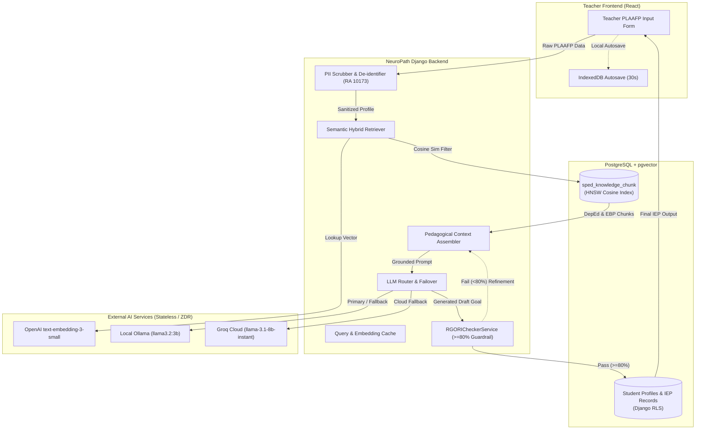
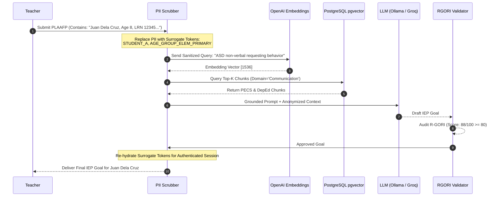

# NeuroPath RAG Architecture Implementation Plan (Epic KAN-7)

## Overview & Executive Summary
As Lead AI Architect for NeuroPath, this plan outlines the architectural blueprint, domain taxonomy, compliance boundaries, and modular technical specification for the **Retrieval-Augmented Generation (RAG) MVP** under overarching Jira Epic **[KAN-7](https://neuropath14.atlassian.net/browse/KAN-7)**.

The RAG pipeline transitions Module 2 (AI-Based IEP Generation) and Module 3 (Instructional Support) from zero-shot prompt drafting to an authoritative, context-grounded system aligned with **DepEd Region VII SPED Guidelines**, **DepEd Order No. 021, s. 2020** (K to 12 Transition Curriculum Framework for Learners with Disabilities), and the **R-GORI** (Revised IFSP/IEP Goals and Objectives Rating Instrument) with structural compliance $\ge 80\%$, while strictly enforcing **RA 10173** (Philippine Data Privacy Act of 2012) for minors with ASD.

---

## Phase 1: Local Requirements Discovery (SRS Synthesis)

Analysis of [SRS_NeuroPath.docx](file:///home/joshua-arco/Documents/NeuroPath/docs/SRS_NeuroPath.docx) extracted the following non-negotiable architectural constraints:

### 1. Data Privacy for Minors (RA 10173 Compliance)
- **Protected Population**: Minors with Autism Spectrum Disorder (ASD). Heightened data protection mandate targeting 100% compliance and 0% data breach tolerance.
- **Strict Anonymization & Pseudonymization**: The backend must strip or pseudonymize all Personally Identifiable Information (PII) — including learner real names, Learner Reference Numbers (LRN), parent/guardian names, birthdates, and residential addresses — *before* transmitting payloads to vector stores or external AI APIs.
- **Zero Data Retention (ZDR)**: External AI services (LLMs, embedding providers) must function exclusively as stateless, ephemeral computation engines with explicit zero-retention policies (no training on learner data).
- **Access Control & Multi-Tenancy**: Django Row-Level Security (RLS) / tenant isolation ensuring a SPED teacher can access only their explicitly assigned student records.
- **Session Security**: Automated termination of teacher sessions after 30 minutes of continuous inactivity. JWTs stored in secure memory or HTTP-only cookies (never unencrypted `localStorage`).

### 2. Performance & SLA Benchmarks
- **Standard Generation Latency**: $\le 10\text{ seconds}$ for standard IEP goal generation under normal load.
- **Full Document Generation**: $\le 30\text{ seconds}$ maximum for complete profiles, goals, and instructional lesson plans.
- **Hard Timeout**: 45 seconds timeout breach threshold. The frontend must abort gracefully, retain form state to prevent user data re-entry, and provide an actionable retry mechanism.
- **Visual Aid Turnaround**: $\le 5\text{ seconds}$ per visual aid (Pollinations AI), dispatched concurrently when multiple aids are required.
- **Concurrency**: Support up to 100 simultaneous teacher requests during peak reporting periods without degrading past the 30-second ceiling.

### 3. Reliability & Offline Resilience
- **Zero Data Loss**: Form state autosaved every 30 seconds to browser IndexedDB, with an offline indicator and automatic background reconciliation upon network restoration.
- **Pedagogical Reliability**: Generated IEP goals must achieve $\ge 80\%$ expert rating on the R-GORI rubric across Measurability, Functionality, Generality, and Instructional Context.

---

## Phase 2: Domain Taxonomies & DepEd Pedagogical Structures

Synthesized from DepEd SPED policy directives (DO 021, s. 2020), the K to 12 Transition Curriculum, and evidence-based practices (EBPs) for elementary learners with ASD:

### 1. Core Developmental Domains (Vector Partitioning Taxonomies)
1. **Communication & Language**:
   - *Sub-areas*: Expressive language, receptive language, pragmatic/social communication, non-verbal vocalizations, Augmentative and Alternative Communication (AAC), Picture Exchange Communication System (PECS Phase I–VI).
2. **Socialization & Peer Interactions**:
   - *Sub-areas*: Joint attention, turn-taking, shared play, social cues interpretation, emotional reciprocity, group classroom participation.
3. **Sensory Processing & Motor Integration**:
   - *Sub-areas*: Proprioceptive and vestibular regulation, sensory diet accommodations (weighted items, sensory breaks, noise-dampening), gross motor coordination, fine motor dexterity (pencil grasp, tool manipulation).
4. **Adaptive & Daily Living Skills (Life Skills)**:
   - *Sub-areas*: Personal hygiene, toileting, feeding routines, dressing, school navigation, task transitions, classroom item management.
5. **Behavioral & Emotional Self-Regulation**:
   - *Sub-areas*: Coping strategies, replacement behaviors for repetitive/disruptive actions, antecedent strategies, Positive Behavioral Interventions and Supports (PBIS), visual schedule adherence.
6. **Cognitive & Functional Academics**:
   - *Sub-areas*: Functional literacy (sight words, environmental print), functional numeracy (counting, monetary concepts, time), pre-vocational task sequencing.

### 2. Authoritative Pedagogical Frameworks for Knowledge Chunks
- **TEACCH Framework**: Physical classroom structuring, visual work schedules, left-to-right work systems, clear visual task boundaries.
- **PECS**: 6-phase systematic communication protocol.
- **DepEd MELCs & MATATAG**: Adapted competencies for elementary learners with developmental delays.
- **R-GORI Alignment Matrix**:
  - *Measurability*: Observable action verbs (identifies, requests, selects, points) + quantifiable criteria (accuracy %, trial counts, latency).
  - *Functionality*: Skills required for daily participation that would otherwise require adult intervention.
  - *Generality*: Generic behavioral concepts adaptable across people, materials, and settings.
  - *Instructional Context*: Natural daily routines executable by any SPED team member.

---

## Phase 3: NeuroPath RAG Architecture Design



### 1. Vector Schema & Indexing (PostgreSQL + pgvector)

```sql
-- Enable vector extension
CREATE EXTENSION IF NOT EXISTS vector;

-- Table: sped_knowledge_chunk
CREATE TABLE IF NOT EXISTS iep_management_spedknowledgechunk (
    id UUID PRIMARY KEY DEFAULT gen_random_uuid(),
    content TEXT NOT NULL,
    domain VARCHAR(64) NOT NULL,          -- Communication, Socialization, Sensory_Motor, Adaptive_Daily_Living, Behavioral, Cognitive
    category VARCHAR(64) NOT NULL,        -- DepEd_Competency, ASD_Intervention, RGORI_Rubric, Accommodation_Strategy
    subcategory VARCHAR(64) NOT NULL,     -- PECS, TEACCH, Sensory_Diet, PBIS, Functional_Numeracy, etc.
    target_age_group VARCHAR(32) NOT NULL, -- Early_Childhood, Elementary_Primary, Elementary_Intermediate
    token_count INTEGER NOT NULL,
    embedding VECTOR(1536) NOT NULL,
    metadata JSONB NOT NULL DEFAULT '{}'::jsonb,
    created_at TIMESTAMPTZ NOT NULL DEFAULT NOW(),
    updated_at TIMESTAMPTZ NOT NULL DEFAULT NOW()
);

-- Fast Approximate Nearest Neighbor Index (HNSW)
CREATE INDEX IF NOT EXISTS idx_sped_knowledge_embedding_hnsw 
ON iep_management_spedknowledgechunk 
USING hnsw (embedding vector_cosine_ops)
WITH (m = 16, ef_construction = 64);

-- Metadata filtering index
CREATE INDEX IF NOT EXISTS idx_sped_knowledge_filter 
ON iep_management_spedknowledgechunk (domain, category, subcategory);
```

#### Chunking & Ingestion Strategy
- **Chunk Size**: Domain-atomic chunks of 150–350 tokens.
- **Integrity**: Each chunk contains a standalone pedagogical unit (e.g., a specific PECS Phase protocol, a TEACCH visual layout rule, or a DepEd Grade 1-3 modified competency).
- **Metadata**: Preserves curriculum source, DepEd order references, and R-GORI indicator mapping.

### 2. Third-Party Services & RA 10173 Security Boundary



- **PII Sanitization Rules**:
  - Name detection and redaction using regex + token surrogate mapping.
  - Stripping of LRNs, school names, dates of birth (converting to developmental age brackets), and addresses.
  - In-memory surrogate resolution: Real identifiers are never written to vector query logs or external API payloads.
- **Provider Multi-Tier Routing**:
  - *Tier 1 (Local/Low-Latency)*: Local Ollama running `llama3.2:3b`.
  - *Tier 2 (High-Capacity Cloud)*: Groq Cloud API `llama-3.1-8b-instant` under strict Zero Data Retention.
  - *Tier 3 (Deterministic)*: Fallback to structured DepEd/R-GORI templates if network/APIs fail.

### 3. Pedagogical Context Injection Pipeline
- **Metadata-Filtered Hybrid Retrieval**: Combines domain filtering (`domain = learner.target_domain`) with cosine similarity ($distance \le 0.35$).
- **Context Grounding Template**: Injects top 3–5 chunks directly into system instructions, explicitly constraining the LLM to emit only measurable action verbs and observable criteria.
- **R-GORI Quality Gate**: Automatic evaluation via `RGORICheckerService`. If total score is $< 80$, the system conducts one targeted automated repair prompt before returning the output to the teacher.

---

## Phase 4: Output & Ticketing Roadmap

### 1. Documentation File Tree (`docs/rag/`)

```
docs/rag/
├── README.md                     # Overview, architecture map, and quickstart
├── architecture.md               # End-to-end RAG architecture, pgvector schema, HNSW indexes
├── third_party_services.md       # LLM routing, embedding APIs, failovers, RA 10173 PII boundary
├── deped_asd_frameworks.md       # DepEd DO 21 s. 2020, MATATAG, MELCs, ASD EBPs, domain taxonomies
└── query_pipeline.md             # Retrieval mechanics, context templates, and R-GORI evaluation loop
```

### 2. Modular File Content Specifications

1. **`docs/rag/README.md`**:
   - System overview, component map, SLA targets ($\le 10\text{s}$, R-GORI $\ge 80\%$, zero PII leakage), and developer quickstart.
2. **`docs/rag/architecture.md`**:
   - Comprehensive architectural blueprints, data flow diagrams, Django ORM schema for `SpedKnowledgeChunk`, PostgreSQL HNSW configuration, and Supabase deployment guidelines.
3. **`docs/rag/third_party_services.md`**:
   - Integration specs for OpenAI `text-embedding-3-small`, Ollama, and Groq; tiering/failover logic; caching strategy; and the RA 10173 PII scrubber design with surrogate token dictionaries.
4. **`docs/rag/deped_asd_frameworks.md`**:
   - Pedagogical taxonomy covering the 6 developmental domains; breakdown of DepEd Transition Curriculum packages (DO 021, s. 2020); evidence-based ASD interventions (PECS, TEACCH, sensory diets); and R-GORI 4-pillar rubric.
5. **`docs/rag/query_pipeline.md`**:
   - Step-by-step query construction, hybrid vector + metadata retrieval, dynamic prompt injection templates, and automated R-GORI verification/regeneration loops.

---

## Jira Child Task Specification (Under Epic KAN-7)

To be created in Jira upon user approval:

- **Project**: Neuropath (`KAN`)
- **Parent Epic**: `KAN-7` (*RAG-MVP-FastTrack*)
- **Issue Type**: `Task`
- **Priority**: `High`
- **Summary**: `Architectural Blueprint, Domain Taxonomies, and Documentation for NeuroPath RAG System`
- **Description**:
  ```markdown
  ### Objective
  Establish the architectural blueprint, DepEd domain taxonomy, and modular documentation for the NeuroPath RAG MVP under Epic KAN-7.

  ### Context
  Guides the implementation of Day 1 to Day 4 milestones for KAN-7, upgrading Module 2 and Module 3 from zero-shot generation to grounded retrieval.

  ### Scope & Deliverables
  - docs/rag/README.md: Architecture index & quickstart
  - docs/rag/architecture.md: PostgreSQL + pgvector schema and HNSW indexing design
  - docs/rag/third_party_services.md: LLM/Embedding routing, caching, and RA 10173 PII boundary
  - docs/rag/deped_asd_frameworks.md: DepEd DO 21 s. 2020, MATATAG, and ASD EBPs taxonomy
  - docs/rag/query_pipeline.md: Metadata-filtered retrieval & R-GORI evaluation loop

  ### Acceptance Criteria
  - Architectural specifications reflect all SRS security constraints (RA 10173, zero data retention for minors).
  - Schema defines pgvector 1536-dim embeddings with HNSW cosine distance indexing.
  - Multi-tier LLM routing includes Ollama local, Groq cloud, and deterministic fallback.
  - R-GORI scoring criteria (>= 80%) integrated into query validation pipeline.
  - All documentation formatted cleanly in GitHub Markdown under docs/rag/.
  ```

---

## User Review Required

> [!IMPORTANT]
> **Zero File/Jira Mutations Until Approval**:
> Per planning protocol, no markdown documentation files under `docs/rag/` or Jira child tasks have been written yet.
> Upon your review and explicit approval of this plan, we will execute the file generation and create the Jira child task linked under Epic `KAN-7`.
