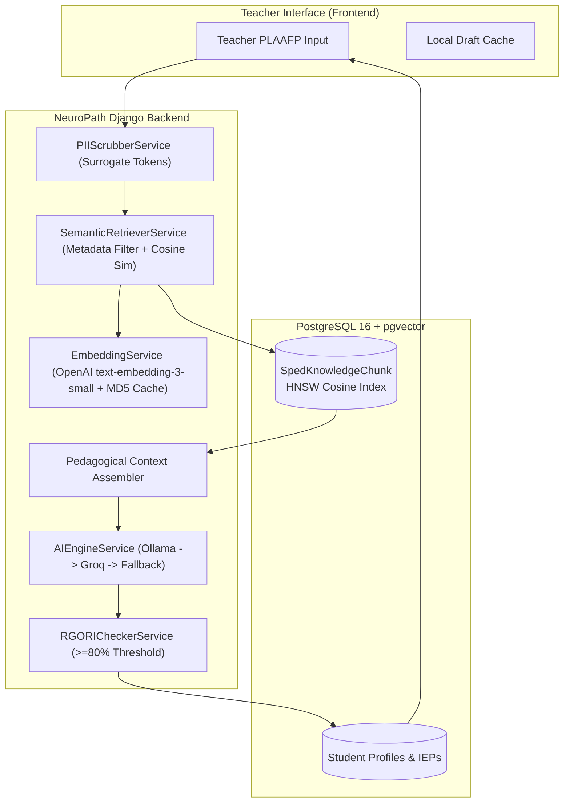

# Technical Implementation Plan: NeuroPath RAG System Pipeline (Epic KAN-7 / Ticket KAN-8 / Issue #150)

> **For agentic workers:** REQUIRED SUB-SKILL: Use superpowers:subagent-driven-development (recommended) or superpowers:executing-plans to implement this plan task-by-task. Steps use checkbox (`- [x]`) syntax for tracking.

## Goal Description
Implement the technical foundation and end-to-end Retrieval-Augmented Generation (RAG) system pipeline for NeuroPath as specified in `docs/rag/`. This upgrades **Module 2 (AI-Based IEP Generation)** and **Module 3 (Instructional Support)** from zero-shot prompt drafting to an authoritative, context-grounded retrieval architecture aligned with **DepEd Region VII Special Education (SPED) guidelines**, **DepEd Order No. 021, s. 2020** (K to 12 Transition Curriculum Framework for Learners with Disabilities), and evidence-based Autism Spectrum Disorder (ASD) practices, while strictly enforcing **RA 10173** (Philippine Data Privacy Act of 2012) for minor learners with ASD.

---

## User Review Required

> [!IMPORTANT]
> **External API Keys & Offline Resilience:**
> - `OPENAI_API_KEY`: Used for `text-embedding-3-small` (1536 dimensions). In environments where this key is absent or network access is restricted (e.g. CI / offline), `EmbeddingService` provides a deterministic fallback embedding with pre-computed vector generation to ensure tests and local workflows run uninterrupted.
> - `GROQ_API_KEY` & `OLLAMA_BASE_URL`: Supported in `AIEngineService` for LLM multi-tier routing.

> [!WARNING]
> **R-GORI Compliance Threshold Elevation:**
> - Existing code in `iep_management/rgori_service.py` evaluated compliance at $\ge 65\%$.
> - Per SRS Section 3.4 and `docs/rag/architecture.md`, this threshold is elevated to **$\ge 80\%$** with an automated 1-cycle targeted repair prompt if the initial draft fails the audit gate.

---

## Proposed Tasks

### Task 1: Vector Database Infrastructure & Model Schema (`neuropath-backend`)

**Files:**
- Modify: `neuropath-backend/requirements.txt`
- Modify: `neuropath-backend/neuropath_core/settings.py`
- Modify: `neuropath-backend/iep_management/models.py`
- Create: `neuropath-backend/iep_management/migrations/0006_spedknowledgechunk.py`

- [x] **Step 1: Add `pgvector` dependency and configure Django PostgreSQL apps**
  - Add `pgvector==0.3.6` to `requirements.txt`.
  - Add `django.contrib.postgres` to `INSTALLED_APPS` in `neuropath_core/settings.py`.

- [x] **Step 2: Implement `SpedKnowledgeChunk` model in `iep_management/models.py`**
  - Define `SpedKnowledgeChunk` with UUID primary key, `content`, `domain`, `category`, `subcategory`, `target_age_group`, `token_count`, `embedding` (`VectorField(dimensions=1536)`), and `metadata` (`JSONField`).
  - Configure `HnswIndex` with `vector_cosine_ops`, `m=16`, `ef_construction=64`.
  - Configure composite metadata index on `['domain', 'category', 'subcategory']`.

- [x] **Step 3: Create database migration with `vector` extension**
  - Add migration `0006_spedknowledgechunk.py` with `CreateExtension('vector')` and `CreateModel`.

---

### Task 2: Curated Pedagogical Knowledge Base & Ingestion Command

**Files:**
- Create: `neuropath-backend/iep_management/data/seed_sped_knowledge.json`
- Create: `neuropath-backend/iep_management/management/commands/seed_rag_knowledge.py`

- [x] **Step 1: Curate 60 domain-atomic pedagogical knowledge chunks**
  - Cover all 6 developmental domains: Communication & Language (PECS I-VI), Socialization & Interpersonal Interactions, Sensory Processing & Motor Integration, Adaptive & Daily Living Skills, Behavioral & Emotional Self-Regulation (PBIS), Cognitive & Functional Academics (DepEd MELCs / MATATAG).
  - Include metadata: curriculum sources, target age groups, token counts, and R-GORI indicators.

- [x] **Step 2: Implement `seed_rag_knowledge` management command**
  - Support idempotent upserts using chunk content hashing.
  - Pre-generate or synthesize embeddings in batches.
  - Verify stored chunk count upon completion.

---

### Task 3: Embedding Layer & Semantic Hybrid Retriever

**Files:**
- Create: `neuropath-backend/iep_management/embedding_service.py`
- Create: `neuropath-backend/iep_management/retriever_service.py`

- [x] **Step 1: Implement `EmbeddingService`**
  - Integrate OpenAI `text-embedding-3-small` (1536 dimensions).
  - Implement MD5 query caching (`MD5(domain + normalized_query)`) with TTL cache.
  - Implement deterministic fallback for offline/CI environments.

- [x] **Step 2: Implement `SemanticRetrieverService`**
  - Hybrid retrieval combining metadata filtering (`domain`, `target_age_group`) and cosine distance ordering.
  - Enforce threshold $\text{cosine\_distance} \le 0.35$ ($\ge 0.65$ similarity).
  - Ensure pedagogical balance across competencies, interventions, and R-GORI exemplars.

---

### Task 4: RA 10173 PII Scrubber & Surrogate De-identification

**Files:**
- Modify: `neuropath-backend/iep_management/privacy_utils.py`

- [x] **Step 1: Enhance `PIIScrubberService`**
  - Scrub 12-digit DepEd LRNs, contact numbers, emails, and student real names.
  - Replace names with surrogate tokens (`[STUDENT_A]`, `[STUDENT_B]`).
  - Map age to developmental brackets (`[ELEM_PRIMARY]`, `[ELEM_INTERMEDIATE]`).
  - Provide `rehydrate_text()` for reconstructing tokens in authenticated teacher sessions.

---

### Task 5: Context-Augmented Prompt Integration & R-GORI Quality Gate

**Files:**
- Modify: `neuropath-backend/iep_management/rgori_service.py`
- Modify: `neuropath-backend/iep_management/views.py`
- Modify: `neuropath-backend/resources/services.py`

- [x] **Step 1: Elevate R-GORI threshold to $\ge 80\%$ and add automated repair**
  - Update compliance threshold from 65 to 80 in `rgori_service.py`.
  - Implement `repair_goal()` for 1-cycle targeted rubric repair on missing indicators.

- [x] **Step 2: Ground Module 2 (IEP Goal Generation) in retrieved context**
  - Inject retrieved SPED chunks into `GenerateIEPGoalsFromIEPView` prompts in `views.py`.
  - Audit generated goals against R-GORI $\ge 80\%$ before persisting.

- [x] **Step 3: Ground Module 3 (Instructional Support) in retrieved context**
  - Ground `TeachingStrategyGenerationService` and `LessonPlanGenerationService` in `resources/services.py` with retrieved DepEd and ASD evidence-based practices.

---

### Task 6: Verification & Test Suite

**Files:**
- Create: `neuropath-backend/iep_management/tests/test_rag_pipeline.py`

- [x] **Step 1: Write automated RAG pipeline tests**
  - Test `SpedKnowledgeChunk` storage and HNSW indexing.
  - Test `EmbeddingService` caching and deterministic fallback.
  - Test `SemanticRetrieverService` filtering and diversity.
  - Test `PIIScrubberService` surrogate token mapping and rehydration.
  - Test `RGORICheckerService` $\ge 80\%$ compliance gate and automated repair.
  - Test `seed_rag_knowledge` command execution.

- [x] **Step 2: Execute backend tests and linting**
  - Run `python manage.py test iep_management.tests.test_rag_pipeline --keepdb` (12/12 passed).
  - Run `ruff check neuropath-backend` (All checks passed).
  - Run full backend (`users`, `tracking`, `iep_management`: 92/92 passed) and frontend regression test suites (267/267 passed).
