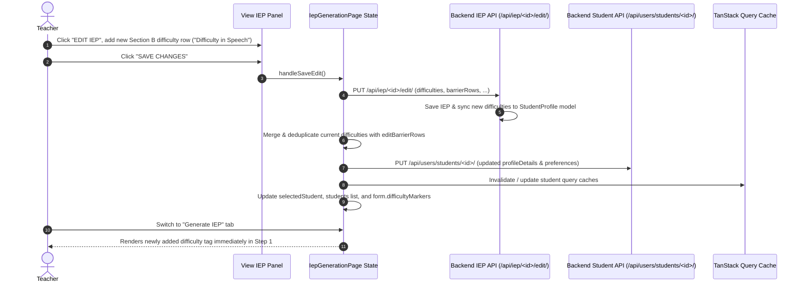

# Fullstack Design Spec: Sync Section B Difficulties to Student Profile and Generator (#135)

## 1. Problem Statement
When editing Section B (*Difficulties, Barriers, and Enabling Supports*) of an existing IEP in the **View IEP** workspace, teachers can add new difficulty rows. However, upon saving the IEP and switching to the **Generate IEP** workflow for that student, the newly added difficulties do not appear in the student's difficulty markers list or the generator's Section B table. 

Difficulties added during IEP review must synchronize directly back to the student's profile difficulty list so that all subsequent IEP generation flows and student profile views reflect the learner's updated difficulties.

## 2. Requirements & Acceptance Criteria
- **Requirement 1 (Profile Synchronization):** When saving an edited IEP in Section B with newly added difficulty rows, update the student's profile difficulties (via `studentsAPI.update` and backend IEP update hook) to include the new difficulty items.
- **Requirement 2 (Immediate Generator Reflection & TanStack Cache):** Update the frontend client state, `selectedStudent`, and TanStack Query cache so the updated difficulties appear immediately when navigating to the "Generate IEP" tab without requiring a page refresh.
- **Requirement 3 (Deduplication):** Deduplicate difficulties so existing markers are not duplicated when syncing from Section B rows (case-insensitive deduplication, preserving order and casing).
- **Acceptance Criteria:**
  1. Adding a new difficulty row in Edit IEP Section B and saving updates the student's profile difficulty list in both the database and client memory.
  2. Navigating to the Generate IEP tab for that student immediately renders the newly added difficulty in the profile-synced difficulties list tag list.
  3. Automated tests in `IepGenerationPage.test.jsx` and backend test suite verify difficulty synchronization between Edit IEP and Generate IEP.

## 3. Architecture & Data Flow

## 4. Component Changes

### 4.1 Backend (`neuropath-backend/iep_management/views.py`)
- In `IEPEditAPIView.perform_update(serializer)`:
  - After saving the `IEPModel` instance, extract all non-empty difficulty values from `instance.difficulties` and `instance.generatedDetails['barrierRows']`.
  - Fetch the associated `StudentProfile` (`instance.studentID`).
  - Read existing `profileDetails.get('difficultyMarkers')` (or `preferences`).
  - Merge existing difficulty markers with the newly added difficulty items using case-insensitive deduplication while preserving original formatting.
  - Persist updated `profileDetails` and `preferences` to `studentID`.

### 4.2 Frontend Helper: `mergeDifficulties` (`neuropath-frontend/src/pages/IepGenerationPage.jsx`)
- Helper function `mergeDifficulties(existingList, newList)`:
  - Iterates through `existingList` and `newList`.
  - Normalizes string items with `.trim()`.
  - Uses `Set` of lowercased strings to filter duplicates.
  - Returns clean array containing original strings in order.

### 4.3 Frontend Save Handler: `handleSaveEdit` / `handleUpdateIep` (`neuropath-frontend/src/pages/IepGenerationPage.jsx`)
- In `handleSaveEdit`:
  - Collect non-empty difficulty entries from `editBarrierRows`.
  - Merge with `getStudentProfileDifficulties(selectedStudent)`.
  - If new difficulties are present:
    - Prepare updated `profileDetails` and `preferences` JSON.
    - Dispatch `studentsAPI.update(studentId, payload)`.
    - Update `selectedStudent` state and `students` list state.
    - Update `form.difficultyMarkers` and `form.barrierRows` if applicable.
    - Update TanStack Query cache via `queryClient` (if initialized in component).

### 4.4 Automated Testing
- `neuropath-frontend/src/pages/IepGenerationPage.test.jsx`:
  - Add test suite: `Sync Section B Difficulties to Student Profile & Generator (#135)`.
  - Test 1: Saving edited Section B with a new difficulty row calls `studentsAPI.update` with merged, deduplicated difficulties.
  - Test 2: Switching from View IEP to Generate IEP after saving shows the new difficulty marker in the generator's profile difficulty list.
  - Test 3: Deduplication ensures duplicate difficulty names (case-insensitive) are not added repeatedly.
- `neuropath-backend/iep_management/tests/test_iep_views.py`:
  - Add test verifying that updating an IEP with new difficulty items in Section B automatically synchronizes `studentID.profileDetails['difficultyMarkers']`.

## 5. Verification Plan
1. Frontend test suite: `npm test` passes with all tests in `IepGenerationPage.test.jsx` passing.
2. Backend test suite: `python manage.py test iep_management users` passes.
3. Clean git status and no regressions in existing IEP generation or View IEP features.
